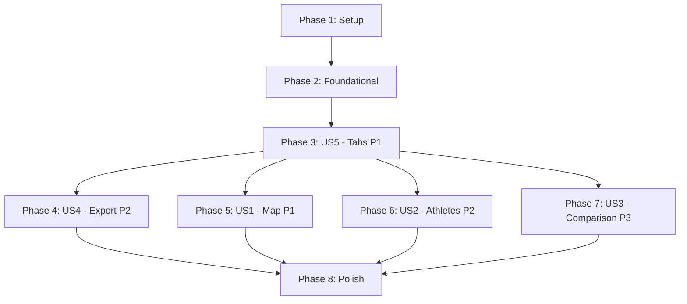

# Tasks: Dashboard Journalistique Olympique

**Input**: Design documents from `/specs/001-journalistic-dashboard/`  
**Prerequisites**: plan.md ✅, spec.md ✅, research.md ✅, data-model.md ✅, contracts/functions.md ✅, quickstart.md ✅

**Feature**: Transform existing Olympic MVP dashboard into comprehensive journalistic tool with:
- Interactive choropleth world map
- Top 10 athletes ranked table
- Two-country comparison timeline
- CSV export functionality
- Tabbed navigation interface

**Organization**: Tasks grouped by user story for independent implementation and testing. No test generation (not requested in spec).

---

## Format: `- [ ] [TaskID] [P?] [Story?] Description with file path`

- **Checkbox**: `- [ ]` (markdown checkbox - REQUIRED)
- **[TaskID]**: Sequential ID (T001, T002, ...) in execution order
- **[P]**: Parallelizable (different files, no blocking dependencies)
- **[Story]**: User story label (US1, US2, etc.) - omit for Setup/Foundational/Polish phases
- **Description**: Clear action with exact file path

---

## Phase 1: Setup (Shared Infrastructure)

**Purpose**: Reference data and constants needed across all user stories

- [ ] T001 Add theme color constants to app.py (THEME_PRIMARY, THEME_BACKGROUND, THEME_SECONDARY_BG, THEME_TEXT, TEAL_SCALE) after imports section
- [ ] T002 [P] Create NOC_TO_COUNTRY mapping dictionary in app.py with ~200 NOC code to country name mappings (e.g., "USA": "United States", "FRA": "France", "URS": "Russia")
- [ ] T003 [P] Create WORLD_COUNTRIES list in app.py with ~195 country names for zero-medal display on choropleth map

**Deliverable**: Constants accessible throughout app.py for theme consistency and geographic mappings

---

## Phase 2: Foundational (Blocking Prerequisites)

**Purpose**: Core data infrastructure that MUST be complete before ANY user story implementation

**⚠️ CRITICAL**: No user story work can begin until this phase is complete

- [ ] T004 Refactor existing data loading into cached load_data() function in app.py with @st.cache_data decorator, type hints (returns pd.DataFrame), and Google-style docstring
- [ ] T005 Extract filter application logic into apply_filters(df, year_filter, sport_filter, noc_filter) function in app.py with type hints and docstring
- [ ] T006 Update main app flow to use filtered_df = apply_filters(df, selected_years, selected_sports, selected_nocs) pattern before any visualizations

**Checkpoint**: ✅ Data loading and filtering refactored - user story implementation can now begin in parallel

---

## Phase 3: User Story 5 - Navigation par Onglets (Priority: P1) 🎯 FOUNDATIONAL UI

**Goal**: Establish tabbed navigation structure to organize all dashboard views

**Why First**: US5 provides the UI framework that US1, US2, US3 will plug into. Completing this enables parallel work on visualization stories.

**Independent Test**: After implementation, verify 4 tabs exist ("Vue d'ensemble", "Carte Mondiale", "Top Athlètes", "Comparateur"), filters remain consistent across tab switches, and existing MVP content displays in Tab 1.

### Implementation for User Story 5

- [ ] T007 [US5] Restructure main app content after filters: create tab1, tab2, tab3, tab4 = st.tabs(["📊 Vue d'ensemble", "🗺️ Carte Mondiale", "🏆 Top Athlètes", "⚖️ Comparateur"]) in app.py
- [ ] T008 [US5] Move existing MVP content (KPIs, evolution chart, gender pie, top 10 countries/sports charts, data table) into with tab1: block in app.py
- [ ] T009 [US5] Add placeholder content for tab2 (with tab2: st.header("Distribution Géographique des Médailles")) in app.py
- [ ] T010 [US5] Add placeholder content for tab3 (with tab3: st.header("Top 10 des Athlètes")) in app.py
- [ ] T011 [US5] Add placeholder content for tab4 (with tab4: st.header("Comparateur de Nations")) in app.py
- [ ] T012 [US5] Verify filters in sidebar remain outside tab structure and apply to filtered_df consistently across all tabs

**Checkpoint**: ✅ Tabbed interface complete - visualization stories (US1, US2, US3) can now proceed in parallel

---

## Phase 4: User Story 4 - Export des Données Filtrées (Priority: P2) 🔧 QUICK WIN

**Goal**: Add CSV export button to sidebar for filtered data download

**Why Now**: US4 is quick to implement, provides immediate value, and doesn't depend on any visualization stories. Completing this frees team capacity for complex visualizations.

**Independent Test**: Apply filters (Year=2000-2004, NOC=FRA), click export button, verify downloaded CSV contains only French medals from 2000-2004 with filename olympics_filtered_YYYY-MM-DD_HHMMSS.csv.

### Implementation for User Story 4

- [ ] T013 [P] [US4] Implement generate_csv_export(df) function in app.py returning tuple[str, str] (csv_data, filename) with timestamp via datetime.now().strftime("%Y-%m-%d_%H%M%S")
- [ ] T014 [US4] Add st.download_button in sidebar after filter widgets with label "📥 Télécharger les données (CSV)", calling generate_csv_export(filtered_df) for data and file_name parameters in app.py
- [ ] T015 [US4] Add edge case handling: if filtered_df is empty, display st.warning("Aucune donnée ne correspond aux filtres appliqués") above download button in app.py

**Checkpoint**: ✅ CSV export functional - users can download filtered datasets

---

## Phase 5: User Story 1 - Exploration Géographique des Médailles (Priority: P1) 🎯 MVP CORE

**Goal**: Implement interactive choropleth world map showing medal density by country

**Why Critical**: This is the most distinctive visual element that transforms the MVP into a journalistic tool. Geographic visualization provides immediate insight into Olympic power distribution.

**Independent Test**: Open "Carte Mondiale" tab without filters, verify map displays all countries (1896-2004 total medals), hover over USA to see medal count tooltip, apply Year=2000-2004 filter and verify map updates showing only medals from that period.

### Implementation for User Story 1

- [ ] T016 [P] [US1] Implement aggregate_medals_by_country(df) function in app.py with @st.cache_data(ttl=600), returns pd.DataFrame with columns [NOC, Country, Total_Medals, Gold, Silver, Bronze]
- [ ] T017 [P] [US1] Implement render_choropleth_map(df_map) function in app.py using px.choropleth() with locationmode="country names", color="Total_Medals", color_continuous_scale=TEAL_SCALE, and French labels
- [ ] T018 [US1] Replace tab2 placeholder content with: df_map = aggregate_medals_by_country(filtered_df); render_choropleth_map(df_map) in app.py
- [ ] T019 [US1] Add zero-medal country handling in aggregate_medals_by_country: pre-populate all WORLD_COUNTRIES with 0 medals before merging with actual data in app.py
- [ ] T020 [US1] Customize choropleth hover template to display "Pays: {Country}, Médailles: {Total_Medals}" with Gold/Silver/Bronze breakdown in app.py
- [ ] T021 [US1] Add validation: log st.warning for unmapped NOC codes (not in NOC_TO_COUNTRY) and exclude from map in app.py

**Checkpoint**: ✅ World map visualization complete - users can explore geographic medal distribution

---

## Phase 6: User Story 2 - Identification des Stars Olympiques (Priority: P2)

**Goal**: Display top 10 athletes ranked by medal count with Olympic tiebreaker logic

**Why Important**: Adds human dimension to statistics by highlighting individual achievement. Complements country-level analysis from US1.

**Independent Test**: Open "Top Athlètes" tab without filters, verify table shows top 10 all-time athletes with columns (Rank, Name, Country, Total, Gold, Silver, Bronze), apply NOC=USA filter and verify only American athletes appear, verify athletes with same total are sorted by Gold→Silver→Bronze.

### Implementation for User Story 2

- [ ] T022 [P] [US2] Implement get_top_athletes(df, limit=10) function in app.py with @st.cache_data(ttl=600), applies multi-column sort [Total DESC, Gold DESC, Silver DESC, Bronze DESC], returns pd.DataFrame with Rank column
- [ ] T023 [P] [US2] Implement render_top_athletes_table(df_athletes) function in app.py using st.dataframe with column_config for French headers (Rang, Nom, Pays, Total, 🥇 Or, 🥈 Argent, 🥉 Bronze)
- [ ] T024 [US2] Replace tab3 placeholder content with: df_athletes = get_top_athletes(filtered_df, limit=10); render_top_athletes_table(df_athletes) in app.py
- [ ] T025 [US2] Add edge case handling in render_top_athletes_table: if df_athletes is empty, display st.info("Aucun athlète trouvé pour ces critères") in app.py
- [ ] T026 [US2] Add medal breakdown aggregation in get_top_athletes: use groupby with Medal column and unstack(fill_value=0) to compute Gold/Silver/Bronze counts in app.py

**Checkpoint**: ✅ Top athletes ranking complete - users can identify Olympic stars

---

## Phase 7: User Story 3 - Comparaison Historique de Nations (Priority: P3)

**Goal**: Enable two-country comparison with timeline chart showing medal evolution

**Why Lower Priority**: More advanced analytical feature for deep-dive rivalry analysis. Not essential for initial deployment but adds significant value for sports journalists.

**Independent Test**: Open "Comparateur" tab, select USA and RUS, verify line chart displays two curves (1896-2004) with different colors, hover over 1980 to see exact medal counts for both countries, select same country twice and verify error message "Veuillez sélectionner deux pays différents".

### Implementation for User Story 3

- [ ] T027 [P] [US3] Implement get_country_comparison_data(df, country1, country2) function in app.py with @st.cache_data(ttl=600), returns pd.DataFrame with columns [Year, Country1_Name, Country1_Medals, Country2_Name, Country2_Medals]
- [ ] T028 [P] [US3] Implement render_comparison_chart(df_comparison, country1, country2) function in app.py using px.line with color_discrete_sequence=[THEME_PRIMARY, "#FF6F00"] for contrast
- [ ] T029 [US3] Replace tab4 placeholder content with: create col1, col2 = st.columns(2); add st.selectbox for country1 and country2 with sorted NOC options in app.py
- [ ] T030 [US3] Add duplicate country validation: if country1 == country2, display st.error("Veuillez sélectionner deux pays différents") in app.py
- [ ] T031 [US3] Add comparison chart rendering: if country1 and country2 are valid and different, call df_comparison = get_country_comparison_data(filtered_df, country1, country2); render_comparison_chart(df_comparison, country1, country2) in app.py
- [ ] T032 [US3] Add empty state handling: if no countries selected, display st.info message inviting user to select two countries to begin comparison in app.py
- [ ] T033 [US3] Implement time-series merge logic in get_country_comparison_data: outer join on Year, fillna(0) for years where one country has no medals in app.py

**Checkpoint**: ✅ Country comparison complete - users can analyze historical rivalries

---

## Phase 8: Polish & Cross-Cutting Concerns

**Purpose**: Final improvements affecting multiple user stories

- [ ] T034 [P] Add performance timing validation: measure initial load time (<3s), filter interaction (<500ms), map rendering (<5s), athlete update (<2s), comparison chart (<3s), CSV export (<2s) to verify success criteria SC-001 through SC-006
- [ ] T035 [P] Verify visual consistency: all Plotly charts use TEAL_SCALE or THEME_PRIMARY colors, no hardcoded colors outside theme constants, matches .streamlit/config.toml theme per SC-007
- [ ] T036 [P] Test all edge cases from spec.md: zero-medal countries (light gray), duplicate country selection (error), empty athlete results (message), empty CSV export (headers only + warning), NOC code unmapped (warning)
- [ ] T037 [P] Add type hints validation: verify all new functions have Python 3.10+ type hints and Google-style docstrings with Args, Returns, Raises sections per constitution principle III
- [ ] T038 [P] Update README.md with new feature descriptions: add sections for world map, top athletes, country comparison, CSV export, and tabbed navigation
- [ ] T039 Run full acceptance testing using spec.md scenarios: test all 5 user stories (25 total acceptance scenarios) to validate feature completeness
- [ ] T040 Performance optimization: verify all aggregation functions use @st.cache_data, cache hit rates are high, no unnecessary recomputation on filter changes

---

## Dependencies & Execution Order

### Phase Dependencies



**Critical Path**:
1. Setup (Phase 1) → Foundational (Phase 2) → Tabs (Phase 3 - US5)
2. After tabs complete, all visualization stories become unblocked

**Parallel Opportunities After Phase 3**:
- US4 (Export), US1 (Map), US2 (Athletes), US3 (Comparison) can all proceed simultaneously
- Different team members can work on different user stories independently

### User Story Dependencies

| Story | Priority | Blocks | Blocked By | Can Parallelize With |
|-------|----------|--------|------------|----------------------|
| **US5 - Tabs** | P1 | US1, US2, US3, US4 | Foundational | None (must complete first) |
| **US4 - Export** | P2 | None | Foundational, US5 | US1, US2, US3 |
| **US1 - Map** | P1 | None | Foundational, US5 | US2, US3, US4 |
| **US2 - Athletes** | P2 | None | Foundational, US5 | US1, US3, US4 |
| **US3 - Comparison** | P3 | None | Foundational, US5 | US1, US2, US4 |

### MVP Delivery Strategy

**Option 1: Minimum Viable Product (Fastest)**
- Phases 1 → 2 → 3 (US5) → 5 (US1) → 8 (Polish)
- **Delivers**: Tabbed interface + World map + Existing MVP content
- **Timeline**: ~60% of total work
- **Value**: Core geographic visualization that differentiates from basic MVP

**Option 2: Enhanced MVP (Recommended)**
- Phases 1 → 2 → 3 (US5) → 4 (US4) → 5 (US1) → 6 (US2) → 8 (Polish)
- **Delivers**: Tabs + Map + Athletes + CSV Export
- **Timeline**: ~85% of total work
- **Value**: Complete individual + country analysis with data export

**Option 3: Full Feature Set**
- All phases 1 → 2 → 3 → 4 → 5 → 6 → 7 → 8
- **Delivers**: All 5 user stories + polish
- **Timeline**: 100% of total work
- **Value**: Complete journalistic dashboard with historical comparison

---

## Parallel Execution Examples

### Within User Story 1 (Map)
```bash
# Parallel: Functions can be written simultaneously
T016 (aggregate_medals_by_country) || T017 (render_choropleth_map)

# Sequential: Must aggregate before rendering, then integrate
T018 (integrate into tab2) → T019 (zero-medal handling) → T020 (tooltips) → T021 (validation)
```

### Within User Story 2 (Athletes)
```bash
# Parallel: Functions independent
T022 (get_top_athletes) || T023 (render_top_athletes_table)

# Sequential: Integrate then add edge cases
T024 (integrate into tab3) → T025 (empty state) → T026 (medal breakdown)
```

### Across User Stories (After Phase 3 Complete)
```bash
# All can proceed in parallel with different developers
Developer A: T013-T015 (US4 - Export)
Developer B: T016-T021 (US1 - Map)
Developer C: T022-T026 (US2 - Athletes)
Developer D: T027-T033 (US3 - Comparison)

# Then all merge for Polish phase
Team: T034-T040 (Polish)
```

---

## Task Completion Summary

**Total Tasks**: 40  
**By Phase**:
- Phase 1 (Setup): 3 tasks
- Phase 2 (Foundational): 3 tasks
- Phase 3 (US5 - Tabs P1): 6 tasks
- Phase 4 (US4 - Export P2): 3 tasks
- Phase 5 (US1 - Map P1): 6 tasks
- Phase 6 (US2 - Athletes P2): 5 tasks
- Phase 7 (US3 - Comparison P3): 7 tasks
- Phase 8 (Polish): 7 tasks

**By User Story**:
- US5 (Navigation): 6 tasks - Foundational UI framework
- US4 (Export): 3 tasks - Quick win utility feature
- US1 (Map): 6 tasks - Core MVP differentiator
- US2 (Athletes): 5 tasks - Individual analysis layer
- US3 (Comparison): 7 tasks - Advanced rivalry analysis

**Parallel Opportunities**: 
- 9 tasks marked [P] can run concurrently within their phase
- 4 user stories (US1, US2, US3, US4) can proceed in parallel after US5 completes

**Estimated Effort** (story points, assuming 1 SP = 1-2 hours):
- Setup + Foundational: 6 SP
- US5 (Tabs): 4 SP
- US4 (Export): 2 SP
- US1 (Map): 8 SP
- US2 (Athletes): 6 SP
- US3 (Comparison): 8 SP
- Polish: 5 SP
- **Total**: ~39 SP (~40-80 hours)

**MVP Milestones**:
- ✅ Checkpoint 1 (After T006): Data infrastructure ready
- ✅ Checkpoint 2 (After T012): Tabbed interface operational
- ✅ Checkpoint 3 (After T015): CSV export functional
- ✅ Checkpoint 4 (After T021): World map complete (MVP core)
- ✅ Checkpoint 5 (After T026): Top athletes ranking complete
- ✅ Checkpoint 6 (After T033): Country comparison complete
- ✅ Checkpoint 7 (After T040): Full feature set validated

---

**Status**: 🚀 **Ready for Implementation**  
**Next Step**: Begin Phase 1 (Setup) - Tasks T001-T003  
**Reference**: See `quickstart.md` for detailed implementation guidance and code samples
